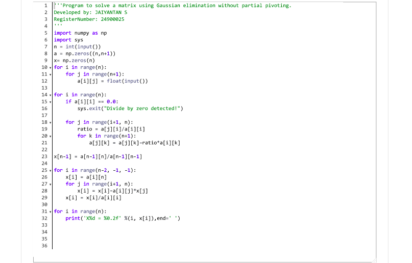

# Gaussian Elimination

## AIM:
To write a program to find the solution of a matrix using Gaussian Elimination.

## Equipments Required:
1. Hardware – PCs
2. Anaconda – Python 3.7 Installation / Moodle-Code Runner

## Algorithm
1. Input matrix dimensions and initialize augmented matrix and solution vector.

2. Populate the augmented matrix with user inputs.

3. Perform Gaussian elimination to reduce the matrix to upper triangular form, ensuring no division by zero.

4. Back substitute to compute solution values for the variables.

5. Print the solution vector formatted to two decimal places.

## Program:
```
/*
Program to find the solution of a matrix using Gaussian Elimination.
Developed by: JAIYANTAN S
RegisterNumber: 24900025
*/
```

## Output:



## Result:
Thus the program to find the solution of a matrix using Gaussian Elimination is written and verified using python programming.

